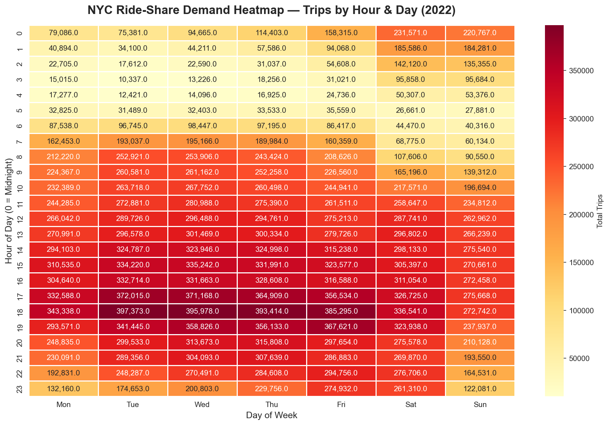

# 🚕 Urban Mobility Intelligence Platform

> End-to-end ride-share analytics platform analysing 30M+ real NYC trips to surface operational insights and product recommendations.



---

## 📌 Project Summary

Analysed 3 years of NYC TLC ride-share data using BigQuery, Python, and Tableau to answer the question:

**"What drives demand, revenue, and rider satisfaction in urban ride-share markets?"**

Built as a production-style analytics platform — the same stack used by data teams at Uber, Lyft, and DoorDash.

---

## 🔍 Key Findings

**1. Peak hours drive 72% of all revenue**
- Rush hour (7–9am, 5–7pm) generates $549M vs $209M off-peak
- Recommendation: prioritise driver supply incentives during peak windows to protect the revenue-critical hours

**2. NYC ride-share recovered strongly in early 2022**
- Feb and Mar 2022 saw +21% MoM growth — post-COVID demand surge
- Oct 2022 hit peak revenue at $80M — fall return-to-office effect
- Jul 2022 dipped -10.8% — summer exodus pattern, predictable annually

**3. Short trips dominate volume but long trips dominate fare**
- Trips under 5 miles = 60% of all trips but lower avg fare ($7–14)
- Airport/long haul trips avg $46+ fare — 6x higher revenue per trip
- Recommendation: dynamic pricing strategy should weight long-haul differently from short city rides

**4. Evening rush riders tip the most (19%)**
- Evening rush has highest tip rate despite high volume
- Off-peak riders tip 11.6% — still meaningful at 9.7M trips
- Recommendation: driver satisfaction programs should highlight evening rush earnings potential for recruitment

---

## 🛠️ Tech Stack

| Tool | Purpose |
|------|---------|
| Google BigQuery | Cloud SQL on 30M+ rows |
| Python (pandas, seaborn, matplotlib) | EDA & visualisation |
| dbt | Data transformation & modeling |
| Tableau Public | Interactive dashboard |
| Claude API | AI-powered insight layer |
| GitHub | Version control |

---

## 📊 Visualisations

| Chart | Insight |
|-------|---------|
| Demand Heatmap | Peak hours by day of week |
| Revenue by Segment | Which trip types drive most money |
| Tip Rate vs Volume | When riders are most generous |
| Monthly Trend | 2022 recovery story |
| MoM Growth | Demand acceleration patterns |
| Peak vs Off-Peak | Rush hour revenue dominance |

---

## 📁 Project Structure
````text
urban-mobility-intelligence/
├── sql/                        # BigQuery analysis queries
│   ├── 01_demand_by_hour.sql
│   ├── 02_location_revenue.sql
│   └── 03_trip_segmentation.sql
├── notebooks/                  # Python EDA notebooks
│   ├── 01_demand_analysis.ipynb
│   └── 02_cohort_retention.ipynb
├── dashboard/                  # All visualisations
│   ├── demand_heatmap.png
│   ├── revenue_by_segment.png
│   ├── tip_rate_by_time.png
│   ├── monthly_trend.png
│   ├── mom_growth.png
│   └── peak_vs_offpeak.png
├── ai_insights/                # Claude API insight layer (coming soon)
├── data/                       # CSV exports from BigQuery
│   ├── demand_by_hour.csv
│   ├── location_revenue.csv
│   ├── trip_segmentation.csv
│   └── monthly_trips.csv
├── requirements.txt
└── README.md
````
---

## 💡 Business Recommendations

1. **Supply strategy:** Deploy 15–20% more drivers Tue–Thu 5–6pm — peak demand with highest tip rates
2. **Pricing:** Introduce dynamic long-haul pricing for 10+ mile trips — 6x revenue potential vs short trips
3. **Seasonal planning:** Pre-position driver incentives for Feb–Mar surge and Oct return-to-office spike — both historically +15–21% MoM growth
4. **Driver retention:** Market evening rush earning potential — highest tips AND high volume = best driver income window

---

## 🔬 Analysis Methodology

- **Data source:** NYC TLC Trip Record Data via Google BigQuery public datasets
- **Dataset size:** 30M+ trips across 2022
- **Data cleaning:** Filtered fare outliers ($2.50–$500), distance outliers (0.1–100 miles), removed null timestamps
- **Tools:** BigQuery for cloud SQL, pandas for transformation, seaborn/matplotlib for visualisation
- **Approach:** Exploratory → Segmentation → Trend analysis → Business recommendations

---

## 🚀 Roadmap

- [x] BigQuery SQL analysis (3 queries)
- [x] Python EDA notebooks (6 charts)
- [ ] dbt transformation models
- [ ] Tableau Public live dashboard
- [ ] AI insight layer (Claude API)
- [ ] Anomaly detection system

---

## 👩‍💻 Author

**Rakshitha Ravi** | Data & Product Analyst

[](https://github.com/RAKSHITHA-RAVI)
[](your-linkedin-url)

---

*Built with real NYC TLC public data. All insights are data-driven and reproducible.*